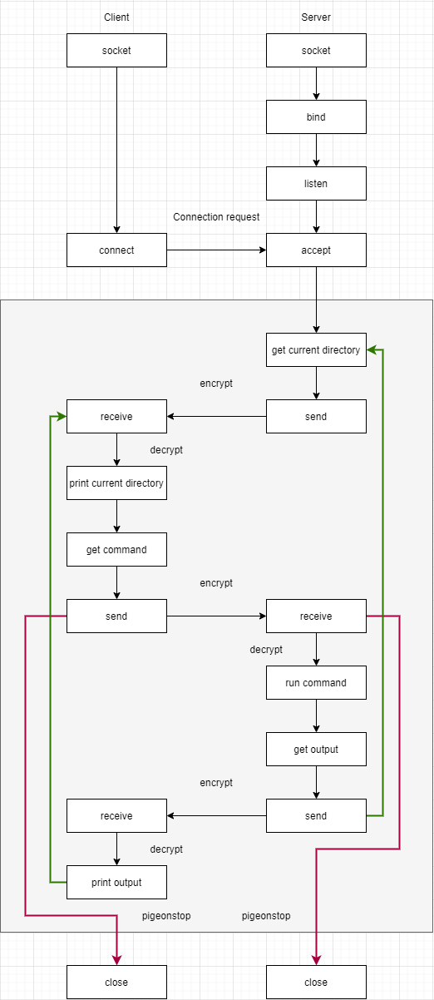
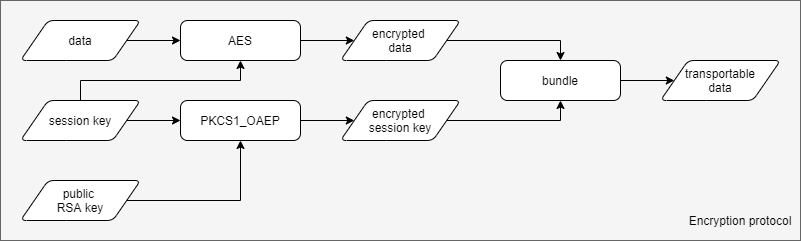
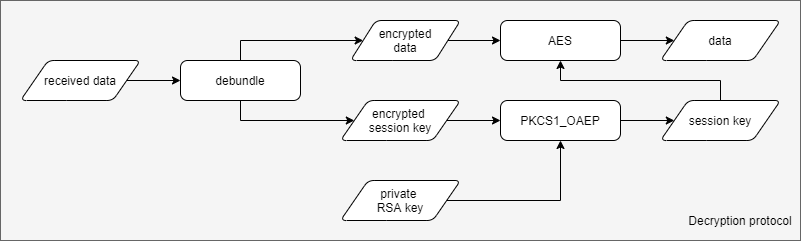

# Pigeon-shell

A non-reactive remote shell

```
                        -
    \                  /   @ )
      \             _/_   |~ \)
        \     ( ( (     \ \
         ( ( ( ( (       | \
_ _=(_(_(_(_(_(_(_  _ _ /  )
                -  _ _ _  /
                      _\___
                     `    "'
```

## Introduction

Pigeon-shell is like [ssh](https://www.ssh.com/) but is not reactive and is one-to-one. In justification of this, one client connects to one server and one server only listens to one client. Moreover, you can run command like `cd` or `bash` etc.

This project is for educational purpose that is to understand how ssh works, how to implement asymmetric encryption, how to implement remote shell over TCP/IP.

## Usage

### `pigeon_key_gen.py`

Example:
`py pigeon_key_gen.py --dec_digits=2048 --save_dir=client`

`py pigeon_key_gen.py --dec_digits=2048 --save_dir=server`

This will create a pair of RSA keys. Private key's length will be equal to `--dec_digits`. Those keys will be saved to `--save_dir`.

Run `py pigeon_key_gen.py --help` for more details.

### `pigeon_client.py`

Example:
`py pigeon_client.py --config_file=client.pigeon.config.json`

This will create a connection to a server with configs defined in a json file.

The json file looks like this
```python
{
    "server_ip" : "10.10.12.84",
    "server_port" : 42,
    "client_private_key" : "client/private.pigeon.txt",
    "server_public_key" : "server/public.pigeon.txt"
}
```

**Note**:
- Remember to replace those configuration when use in a new environment

### `pigeon_server.py`

Example:
`py pigeon_sever.py --config_file=server.pigeon.config.json`

This will setup a server with config defined in a json file.

The json looks like this
```python
{
    "server_port" : 42,
    "server_private_key" : "server/private.pigeon.txt",
    "client_public_key" : "client/public.pigeon.txt"
}
```

**Note**:
- Remember to replace those configuration when use in a new environment

## Implementation

Python 3

Install dependencies with `pip install -r req.txt`

## Protocols



Pigeon-shell client-server protocol



Encryption protocol



Decryption protocol

